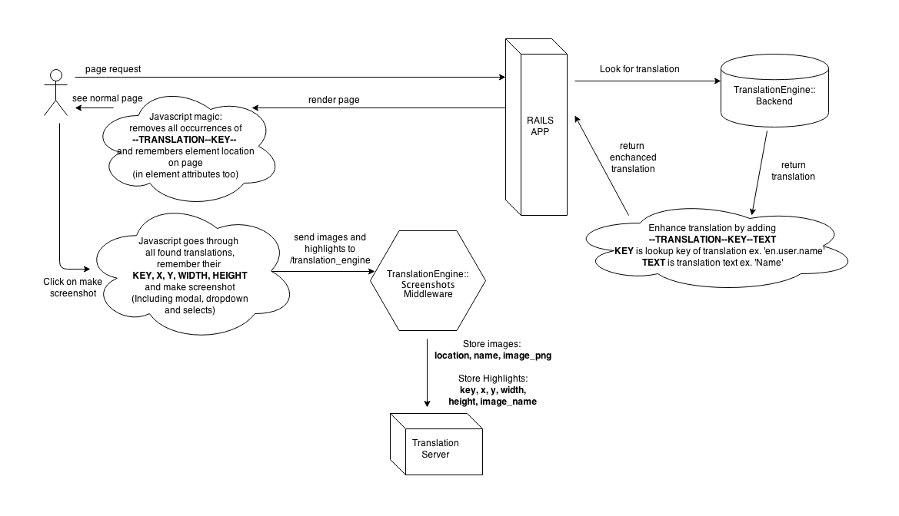

# TranslationEngine

```
gem 'translation_engine', git: 'https://github.com/blueberryapps/translation-engine.git'
```

## Configuration

Default configuration is that all part are turned off, so for enabling you need
to create file `config/initializers/translation_engine.rb` with this content:

```ruby
# config/initializers/translation_engine.rb

TranslationEngine.config do |config|
  # key for user
  config.api_key  = 'API_KEY'

  # url to Translation Server
  config.api_host = 'http://127.0.0.1:3000'

  # enable screenshot functionality (default is false)
  config.use_screenshots  = true

  # enable to send translation after every request and receive translations
  # when something changed (default is false)
  config.use_catcher      = true

  # for production envs you don't want to send translations
  # so if use_catcher is true you can disable sending them by this option:
  config.disable_sending_translations = true

  # Timeout for connecting to translation server
  # config.timeout = 5

  # If true TranslationEngine will throw exceptions on connection problems
  # If false TranslationEngine will just log exception to Rails.logger
  config.raise_exceptions = Rails.env.development?
end
```

## Releases

```
# list all possible releases
I18n.backend.releases

# list all possible release which has same locale as I18n.locale
I18n.backend.current_locale_releases
```
### Switch release on frontend

```slim
- I18n.backend.current_locale_releases.each do |release|
  = link_to release.version.upcase,
            { translation_release: release.version },
            class: ('active' if release.current?)
```

## Screenshots Integration

### Javascript
Require javascript by inserting `app/assets/javascripts/application.js`
```
//= require translation_engine/screenshots
```
or in views `= javascript_include_tag 'translation_engine/screenshots'`
(this javascript is already precompiled, so you don't need to do anything else)

Ensure that you have jquery + coffeescript
(or similar gems which provides same function)

```ruby
gem 'coffee-rails'
gem 'jquery-rails'
```

### Stylesheets
Require stylesheets by inserting `app/assets/stylesheets/application.sass`:

```
@import 'translation_engine/screenshots'
```

or in views `= stylesheet_link_tag 'translation_engine/screenshots'`
(this stylesheet is already precompiled, so you don't need to do anything else)

### Start translations screenshoting
Create element with class `translation_engine_start`.
When you click on this element, Translation Engine will start screenshoting page
and then sends all images + highlights to server `/transaltion_engine` which
will be catched by `ScreenshotsMiddleware` and then send to TranslationServer.

or

Use callback `window.TranslationEngine.start()`

### Show translations and keys + link to translation server
Create element with class `translation_highlight_start`.

When you click on this element, Translation Engine will show keys instead of text to all
translated text in page and it will add link to translation server.

or

Use callback `window.TranslationEngine.highlight()`

## Rake tasks

### `rake translation_engine:list:releases`

List all available releases from Translations Server


### `rake translation_engine:pull:master`

Download all master translations from Translations server and store them
into config/locales/z_translation_engine.yml

### `rake translation_engine:pull:release RELEASE=en_v001`

Download released translations from Translations server and store them
into config/locales/z_releases/(release_locale).yml,
will overwrite previous locale release, leaving allways only one release.

## Architecture of service


Catcher is middleware in rails APP which catches all used translations in page
and then it sends them into Translation Server.



Screenshots middleware takes highlights and images which sends into Translation
Server.
